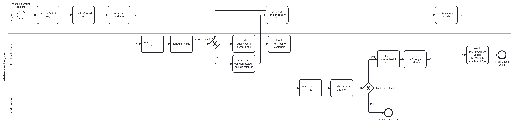

# Credit Application Process (BPMN 2.0)

## Overview

This project models a bank credit application process using BPMN 2.0.

## Tools

- Bizagi Modeler
- BPMN 2.0

## Process Includes

- Customer application
- Document verification
- Credit assessment
- Credit committee decision
- Contract preparation
- Contract signing
- Loan disbursement

## BPMN Diagram

## Purpose

This project was created as part of my IT Business Analysis training to improve my business process modeling skills using BPMN 2.0.
